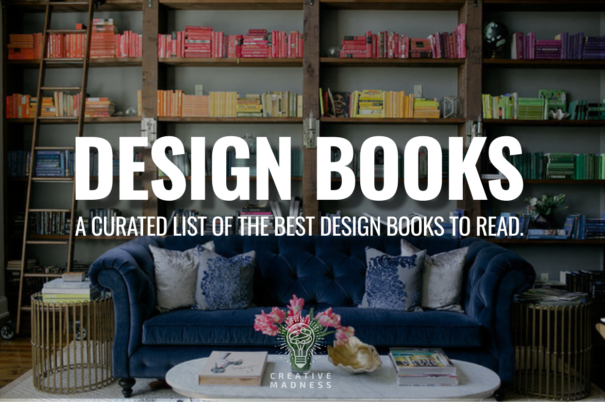
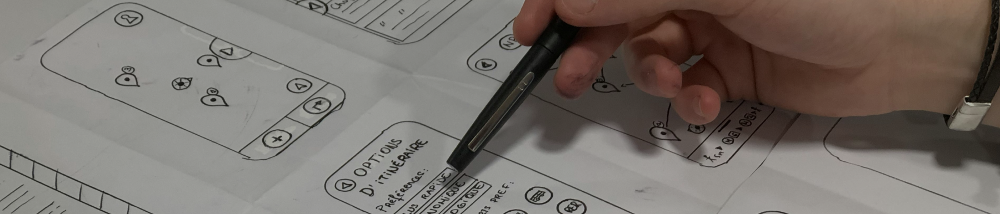

# Design Books

_A curated collection of design books that have shaped my professional practice and personal development—curated by Greg Robleto (robleto.com)._ 

## Table of Contents

1. **📚**[ **Business** ](https://github.com/robleto/design-books?tab=readme-ov-file#01-business)
2. **📚** [**Product Design**](https://github.com/robleto/design-books?tab=readme-ov-file#02-product-design)
3. **📚** [**UX Research**](https://github.com/robleto/design-books?tab=readme-ov-file#03-ux-research)
4. **📚** [**Interaction Design**](https://github.com/robleto/design-books?tab=readme-ov-file#04-interaction-design)
5. **📚** [**User Interface Design**](https://github.com/robleto/design-books?tab=readme-ov-file#05-user-interface-designer)
6. **📚** [**Beginner Design 101**](https://github.com/robleto/design-books?tab=readme-ov-file#06-beginner-design-101)
7. **📚** [**Design Management**](https://github.com/robleto/design-books?tab=readme-ov-file#07--design-management)

.

---

## 01. Business

> _A curated selection of business books focusing on innovation, product development, and organizational growth. Includes foundational works on startup methodology, design thinking, and business transformation strategies._

- 📔 [**Creativity**](https://www.amazon.com/Creativity-Innovators-Genius-Ed-Catmull-ebook/dp/B073X3YG58) _by Ed Catmull_
- 📔 [**Crossing the Chasm**](https://www.amazon.com/Crossing-Chasm-Marketing-High-Tech-Mainstream/dp/0060517123) _by Geoffrey Moore_
- 📔 [**Good to Great**](https://www.amazon.com/Good-Great-Some-Companies-Others/dp/0066620996) _by Jim Collins_
- 📔 [**Inspired: How to Create Tech Products Customers Love**](https://www.amazon.com/Inspired-Create-Products-Customers-Love/dp/149197196X) _by Marty Cagann_
- 📔 [**The Innovator's Dilemma**](https://www.amazon.com/Innovators-Dilemma-Revolutionary-Business-Books/dp/0062060244) _by Clayton Christensen_
- 📔 [**The Lean Startup**](https://www.amazon.com/Lean-Startup-Entrepreneurs-Continuous-Innovation/dp/0307887898) _by Eric Ries_
- 📔 [**Sprint**](https://www.amazon.com/Sprint-Make-Week-Solve-Problems/dp/150112174X) _by Jake Knapp_
- 📔 [**Universal Principles of Design**](https://www.amazon.com/Universal-Principles-Design-William-Lidwell/dp/159253006X) _by William Lidwell, Kritina Holden, and Jill Butler_

.

---

## 02. **Product Design**

> _A curated list of essential product design books covering user experience fundamentals, behavioral psychology, product strategy, and design thinking methodologies. These resources help designers create engaging digital products through proven frameworks and research-backed principles._

- 📕 [**Build Better Products**](https://www.amazon.com/Build-Better-Products-Centered-Development/dp/1491971444) _by Laura Klein_
- 📕 [**The Shape of Design**](https://www.amazon.com/Shape-Design-Frank-Chimero/dp/1940282050) _by Frank Chimero_
- 📕 [**The Design Thinking Playbook**](https://www.amazon.com/Design-Thinking-Playbook-Practical-Innovators/dp/1119431052) _by Michael Lewrick, Patrick Link, and Larry Leifer_
- 📕 [**Designing Interactions**](https://www.amazon.com/Designing-Interactions-Bill-Moggridge/dp/0738999320) _by Bill Moggridge_
- 📕 [**Don't Make Me Think**](https://www.amazon.com/Dont-Make-Think-Revisited-Usability/dp/0321965515) _by Steve Krug_
- 📕 [**Hooked**](https://www.amazon.com/Hooked-How-Build-Habit-Forming-Products/dp/1591847788) _by Nir Eyal_
- 📕 [**The Inmates are Running the Asylum**](https://www.amazon.com/Inmates-Running-Asylum-Insane-Situations/dp/0133173586) _by Alan Cooper_
- 📕 [**Lean UX**](https://www.amazon.com/Lean-UX-Designers-Developers-Collaboration/dp/1491953608) _by Jeff Gothelf and Josh Seiden_
- 📕 [**The Lean Product Playbook**](https://www.amazon.com/Lean-Product-Playbook-Launch-Brilliant/dp/1491974514) _by Dan Olsen_
- 📕 [**Rework**](https://www.amazon.com/Rework-Jason-Fried/dp/0307463745) _by Jason Fried and David Heinemeier Hansson_
- 📕 [**Scaling Up Excellence**](https://www.amazon.com/Scaling-Up-Excellence-Settling-Less/dp/0804141213) _by Robert Sutton and Huggy Rao_
- 📕 [**Sprint**](https://www.amazon.com/Sprint-Solve-Big-Problems-Little-Time/dp/150112174X) _by Jake Knapp, John Zeratsky, and Braden Kowitz_
- 📕 [**The Design of Everyday Things**](https://www.amazon.com/Design-Everyday-Things-Revised-Expanded/dp/0465050654) _by Donald A. Norman_
- 📕 [**Universal Principles of Design**](https://www.amazon.com/Universal-Principles-Design-William-Lidwell/dp/159253008X) _by William Lidwell, Kritina Holden, and Jill Butler_
- 📕 [**UX Strategy: How to Devise Innovative Digital Products that People Want**](https://www.amazon.com/Ux-Strategy-Innovative-Digital-Products/dp/0134056445) _by Jaime Levy_

.

---

## 03. **UX Research**

> _A curated selection of UX research books focused on user research methodologies, interview techniques, usability testing approaches, and data analysis frameworks to help researchers conduct effective studies and deliver actionable insights._

- 📗 [**100 Things Every Designer Needs to Know About People**](https://www.amazon.com/Things-Every-Designer-Needs-Know/dp/0321767535) _by Susan M. Weinschenk_
- 📗 [**A Project Guide to UX Design: For User Experience Designers in the Field or in the Making**](https://www.amazon.com/Project-Guide-UX-Design-Experience/dp/0321815386) _by Russ Unger and Carolyn Chandler_
- 📗 [**Bottlenecks: Aligning UX Design with User Psychology**](https://www.amazon.com/Bottlenecks-Aligning-Design-Psychology-User/dp/0128171896) _by David Evans_
- 📗 [**The Design of Everyday Things**](https://www.amazon.com/Design-Everyday-Things-Donald-Norman/dp/0465067107) _by Don Norman_
- 📗 [**Designing for Behavior Change**](https://www.amazon.com/Designing-Behavior-Change-Applied-Psychology/dp/1449307728) _by Stephen Wendel_
- 📗 [**Designing for Emotion**](https://www.amazon.com/Designing-Emotion-Aarron-Walter/dp/0321725544) _by Aarron Walter_
- 📗 [**Don't Make Me Think: A Common Sense Approach to Web Usability**](https://www.amazon.com/Dont-Make-Think-Common-Usability/dp/0321965515) _by Steve Krug_
- 📗 [**The Elements of User Experience: User-Centered Design for the Web**](https://www.amazon.com/Elements-User-Experience-Centered-Design/dp/1933820249) _by Jesse James Garrett_
- 📗 [**Laws of UX**](https://www.amazon.com/Laws-UX-Jon-Yablonski/dp/173209897X) _by Jon Yablonski_
- 📗 [**Observing the User Experience, Second Edition: A Practitioner's Guide to User Research**](https://www.amazon.com/Observing-User-Experience-Second-Practitioners/dp/0123848681) _by Mike Kuniavsky_
- 📗 [**Understanding Users: A Practical Guide to User Research Methods**](https://www.amazon.com/Understanding-Users-Practical-Research-Methods/dp/0123848690) _by Kathy Baxter and Catherine Courage_
- 📗 [**The User is Always Right**](https://www.amazon.com/User-Always-Right-Experience-Centered/dp/0321658701) _by Steve Mulder_

.

---

## 04. **Interaction Design**

> _A comprehensive collection of books focused on interaction design principles, patterns, and best practices. These resources help designers create intuitive and engaging digital experiences through effective interface design, user flows, and interactive elements._

- 📘 [**About Face 3: The Essentials of Interaction Design**](https://www.amazon.com/About-Face-Essentials-Interaction-Design/dp/1118766571) _by Alan Cooper, Robert Reimann, David Cronin, and Christopher Noessel_
- 📘 [**The Design of Everyday Things**](https://www.amazon.com/Design-Everyday-Things-Revised-Expanded/dp/0465067107) _by Don Norman_
- 📘 [**Designing Interfaces**](https://www.amazon.com/Designing-Interfaces-Patterns-Effective-Interaction/dp/1449379702) _by Jenifer Tidwell_
- 📘 [**Designing Interactions**](https://www.amazon.com/Designing-Interactions-Bill-Moggridge/dp/0262134748) _by Bill Moggridge_
- 📘 [**Emotional Design: Why We Love (or Hate) Everyday Things**](https://www.amazon.com/Emotional-Design-Why-Everyday-Things/dp/0465051343) _by Don Norman_
- 📘 [**Interaction Design: Beyond Human-Computer Interaction**](https://www.amazon.com/Interaction-Design-Beyond-Human-Computer-Interaction-ebook/dp/B00KPYG3VY) _by Jenny Preece, Helen Sharp, Yvonne Rogers_
- 📘 [**Interaction Design: Creating Innovative Applications and Devices**](https://www.amazon.com/Interaction-Design-Creating-Innovative-Applications/dp/0123736023) _by Dan Saffer_
- 📘 [**Seductive Interaction Design: Creating Playful, Fun, and Effective User Experiences**](https://www.amazon.com/Seductive-Interaction-Design-Playful-Experiences/dp/0321725568) _by Stephen Anderson_
- 📘 [**The Art of Interaction Design**](https://www.amazon.com/Art-Interaction-Design-John-Zimmerman/dp/0131428479) _by John Zimmerman_
- 📘 [**The UX Book: Process and Guidelines for Ensuring a Quality User Experience**](https://www.amazon.com/UX-Book-Process-Guidelines-Ensuring/dp/0123848695) _by Rex Hartson and Pardha Pyla_
- 📘 [**The UX Book: Process and Guidelines for Ensuring a Quality User Experience**](https://www.amazon.com/UX-Book-Process-Guidelines-Ensuring/dp/0123848695) _by Rex Hartson and Pardha Pyla_

.

---

## 05. **User Interface Designer**

> _A curated collection of essential UI design books focused on visual design principles, interface patterns, and layout fundamentals to help designers create intuitive and visually appealing user interfaces._

- 📙[**About Face**](https://www.amazon.com/About-Face-Interaction-Design-Essentials/dp/1118766571)_by Alan Cooper and Robert Reimann_
- 📙 [**The Design of Everyday Things**](https://www.amazon.com/Design-Everyday-Things-Donald-Norman/dp/0465067107) _by Don Norman_
- 📙 [**Designing Interfaces**](https://www.amazon.com/Designing-Interfaces-Jennifer-Tidwell/dp/1491927400) _by Jenifer Tidwell_
- 📙 [**Designing Interactions**](https://www.amazon.com/Designing-Interactions-Bill-Moggridge/dp/0735619670) _by Bill Moggridge_
- 📙 [**Designing Visual Interfaces**](https://www.amazon.com/Designing-Visual-Interfaces-Techniques-User/dp/0134399318) _by Kevin Mullet and Darrell Sano_
- 📙 [**Designing with Web Standards**](https://www.amazon.com/Designing-Web-Standards-Jeffrey-Zeldman/dp/0321616952) _by Jeffrey Zeldman_
- 📙 [**The Inmates Are Running the Asylum**](https://www.amazon.com/Inmates-Running-Asylum-Industrys-Crazy/dp/0672326140) _by Alan Cooper_
- 📙 [**Rocket Surgery Made Easy**](https://www.amazon.com/Rocket-Surgery-Made-Easy-Usability/dp/0321657292) _by Steve Krug_
- 📙 [**Sketching User Experiences**](https://www.amazon.com/Sketching-User-Experiences-Interactive-Techniques/dp/0123814642) _by Bill Buxton_
- 📙 [**Universal Principles of Design**](https://www.amazon.com/Universal-Principles-Design-William-Lidwell/dp/1592530084) _by William Lidwell, Kritina Holden, and Jill Butler_

.

---

## 06. **Beginner Design 101**

> _An essential reading list for design beginners covering fundamental principles, user-centered design approaches, and core methodologies to build a solid foundation in design practice._

- 📓 [**100 Things Every Designer Needs to Know About People**](https://www.amazon.com/Things-Designer-Needs-About-People/dp/0132790426) _by Susan M. Weinschenk_
- 📓 [**Design Is a Job**](https://www.amazon.com/Design-Job-Mike-Monteiro/dp/1937557131) _by Mike Monteiro_
- 📓 [**Design for Real Life**](https://www.amazon.com/Design-Real-Life-Empathy-Technology/dp/1933820617) _by Eric Meyer and Sara Wachter-Boettcher_
- 📓 [**The Design Sprint**](https://www.amazon.com/Design-Sprint-Solve-Problems-Validated/dp/0636920051305) _by Jake Knapp, John Zeratsky, and Braden Kowitz_
- 📓 [**Designing Interactions**](https://www.amazon.com/Designing-Interactions-Bill-Moggridge/dp/0785342650) _by Bill Moggridge_
- 📓 [**Designing with Type**](https://www.amazon.com/Designing-Type-James-Craig/dp/0471445228) _by James Craig_
- 📓 [**Graphic Design Thinking: Beyond Form and Function**](https://www.amazon.com/Graphic-Design-Thinking-Beyond-Function/dp/1616890775) _by Ellen Lupton_
- 📓 [**The Handbook of Usability Testing: How to Plan, Design, and Conduct Effective Tests**](https://www.amazon.com/Handbook-Usability-Testing-Effective-Techniques/dp/0470185477) _by Jeffrey Rubin_
- 📓 [**How to be a Graphic Designer Without Losing Your Soul**](https://www.amazon.com/How-Graphic-Designer-Without-Losing/dp/1786270875) _by Adrian Shaughnessy_
- 📓 [**The Power of Color in UI Design**](https://www.amazon.com/Power-Color-Design-Nick-Babich/dp/0134670048) _by Nick Babich_
- 📓 [**The Shape of Design**](https://www.amazon.com/Shape-Design-Frank-Chimero/dp/1457188101) _by Frank Chimero_
- 📓 [**Solving Product Design Exercises**](https://www.amazon.com/Solving-Product-Design-Exercises-Dashinsky/dp/098678631X) _by Artiom Dashinsky_
- 📓 [**Universal Principles of Design**](https://www.amazon.com/Universal-Principles-Design-William-Lidwell/dp/1592530020) _by William Lidwell_
- 📓 [**The User Experience Team of One**](https://www.amazon.com/User-Experience-Team-Leah-Buley/dp/1933820074) _by Leah Buley_
- 📓 [**The UX Book: Process and Guidelines for Ensuring a Quality User Experience**](https://www.amazon.com/UX-Book-Process-Guidelines-Ensuring/dp/0123848695) _by Rex Hartson and Pardha Pyla_
- 📓 [**UX Design for Beginners: A Crash Course in 100 Short Lessons**](https://www.amazon.com/UX-Design-Beginners-Crash-Course/dp/1119538050) _by James Royal-Lawson, Per Axbom_
- 📓 [**The UX Design Process: A Beginner's Guide**](https://www.amazon.com/UX-Design-Process-Beginners-Guide/dp/0789751514) _by Nick Babich_
- 📓 [**The Vignelli canon**](https://www.amazon.com/Vignelli-Canon-Massimo-Vignelli/dp/372120055X) _by Massimo Vignelli_

.

---

## **07.  Design Management**

> _A collection of essential books for design managers and leaders covering team management, product strategy, organizational design, and leadership principles to effectively guide design teams and drive innovation._

- 📒 [**Crucial Conversations: Tools for Talking When Stakes are High**](https://www.amazon.com/Crucial-Conversations-Talking-When-Stakes/dp/0071771328) _by Kerry Patterson, Joseph Grenny, Ron McMillan, Al Switzler_
- 📒 [**Design Leadership**](https://www.amazon.com/Design-Leadership-Creating-Organizations-Experience/dp/1491953286) _by Richard Banfield_
- 📒 [**The Design Thinking Playbook**](https://www.amazon.com/Design-Thinking-Playbook-Practical-Innovation/dp/1119555179) _by Michael Lewrick, Patrick Link, and Larry Leifer_
- 📒 [**Drive: The Surprising Truth About What Motivates Us**](https://www.amazon.com/Drive-Surprising-Truth-About-Motivates/dp/1594484805) _by Daniel H. Pink_
- 📒 [**Inspired: How To Create Tech Products Customers Love**](https://www.amazon.com/Inspired-Create-Products-Customers-Love/dp/149197196X) _by Marty Cagan_
- 📒 [**The Lean Product Playbook**](https://www.amazon.com/Lean-Product-Playbook-Launch-Products/dp/1491973760) _by Dan Olsen_
- 📒 [**Managing Humans**](https://www.amazon.com/Managing-Humans-Humorous-Software-Development/dp/1484231147) _by Michael Lopp_
- 📒 [**The Manager's Path**](https://www.amazon.com/Managers-Path-Leaders-Navigating-Growth/dp/1491973897) _by Camille Fournier_
- 📒 [**Org Design for Design Orgs**](https://www.amazon.com/Org-Design-Design-Organizations-Experience/dp/1491953283) _by Peter Merholz_
- 📒 [**The Power of Intentional Leadership**](https://www.amazon.com/Power-Intentional-Leadership-Create-Organization/dp/1633694418) _by Joanne Miller_
- 📒 [**Scaling Up Excellence**](https://www.amazon.com/Scaling-Up-Excellence-Getting-More/db/0804137382) _by Robert Sutton and Huggy Rao_

.

